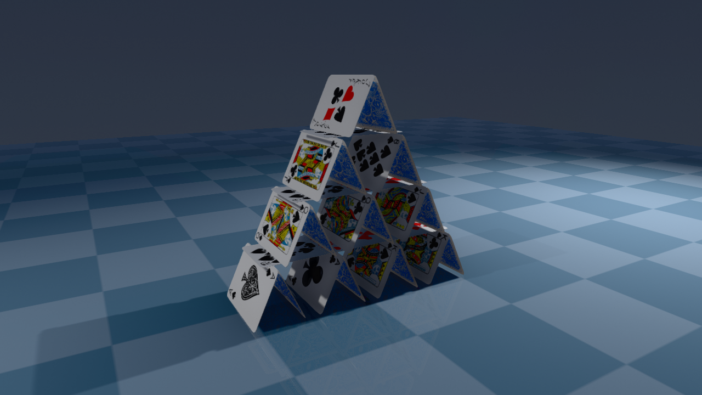

# Cards

Playing-card models, sharing the card mesh and face textures in [`assets`](assets).

  

| Model | Description |
| --- | --- |
| [`cards.xml`](cards.xml) | A deck of loose cards. |
| [`house_of_cards.xml`](house_of_cards.xml) | A 26-card, four-storey house. |

The house stands on friction alone, and stays standing: settled, it drifts by about a millimetre
over two minutes of simulated time. Cards are 0.7 mm thick, so the contacts are the awkward kind —
nearly parallel faces meeting at shallow angles, where a collider has the least information to work
with. Two details carry the model:

* **Collision cards are a thin box with a capsule-rounded perimeter.** Edge contacts between thin
  boxes are degenerate; capsules along all four edges are well-conditioned. The visual card is a
  separate, non-colliding mesh.
* **Every card carries a baked-in yaw of a few tenths of a degree, and a fraction of a millimetre
  of jitter along the ridges.** Exactly symmetric, perfectly aligned stacks are adversarial for a
  collider: the pristine arrangement is the one that falls over.

Frictional stacking of this kind requires `cone="elliptic"` and a large `impratio`. The model
enables [sleeping](https://mujoco.readthedocs.io/en/latest/computation/index.html#sleeping): the
settled house falls asleep within ~0.1 s, after which it costs almost nothing to simulate and
cannot creep at all. Sleeping is also what lets the model do without `noslip_iterations` — the
slow frictional creep that would eventually tip the apex tent can only accumulate while the house
is awake, and after a disturbance it is asleep again within a fraction of a second; see the
comments in the file.

## Changelog

* 27-08-2026: Enabled sleeping and dropped `noslip_iterations`; the model now simulates ~2.8x
  realtime while awake and ~100x realtime once asleep, with less drift than before.
* 05-08-2026: Added `house_of_cards.xml`.
